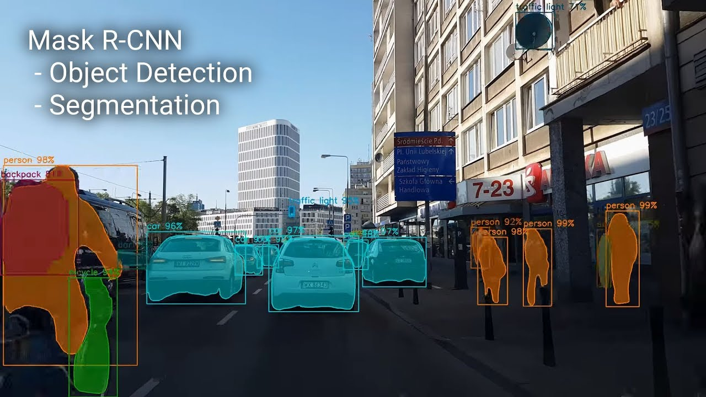
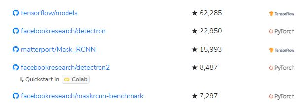

# OVER VIEW OF THIS WEEK-1

### What I Am Trying To Do 

* Set up & Install [Mask_RCNN](https://github.com/matterport/Mask_RCNN)
* Run [demo.ipynb](https://github.com/matterport/Mask_RCNN/blob/master/samples/demo.ipynb) 
* Run [samples](https://github.com/matterport/Mask_RCNN/tree/master/samples)/[balloon](https://github.com/matterport/Mask_RCNN/tree/master/samples/balloon) & other samples, [Inspect data](https://github.com/matterport/Mask_RCNN/blob/master/samples/balloon/inspect_balloon_data.ipynb) & [Inspect model](https://github.com/matterport/Mask_RCNN/blob/master/samples/balloon/inspect_balloon_model.ipynb) etc.
* Read the code, Learn how to Run Mask_RCNN on [coco dataset ](http://cocodataset.org/#download) or other dataset
* Learn how to Run Mask_RCNN on custom dataset
  * How to prepare custom dataset for Mask_RCNN
  * How to change the code to train a custom dataset
  * Inspect training data & Inspect model of the new dataset

* Run Mask_RCNN on my own dataset
  * prepare my own custom dataset
  * change the code
  * training data & Inspect model

* Explore other framework

  * **[detectron2](https://github.com/facebookresearch/detectron2)**

  * **[maskrcnn-benchmark](https://github.com/facebookresearch/maskrcnn-benchmark)**

  * **[Detectron](https://github.com/facebookresearch/Detectron)**

  * [py-faster-rcnn](https://github.com/rbgirshick/py-faster-rcnn)

  * [mmdetection](https://github.com/open-mmlab/mmdetection)

    

### 2. Why I Do it 

1. Instance Segmentation = Object Detection (bounding box) + Semantic Segmentation

   

### 3. What Have I Done

- [x] Set up & Install [Mask_RCNN](https://github.com/matterport/Mask_RCNN)

- [x] Run [demo.ipynb](https://github.com/matterport/Mask_RCNN/blob/master/samples/demo.ipynb) 

- [ ] Run [samples](https://github.com/matterport/Mask_RCNN/tree/master/samples)/[balloon](https://github.com/matterport/Mask_RCNN/tree/master/samples/balloon) & other samples, [Inspect data](https://github.com/matterport/Mask_RCNN/blob/master/samples/balloon/inspect_balloon_data.ipynb) & [Inspect model](https://github.com/matterport/Mask_RCNN/blob/master/samples/balloon/inspect_balloon_model.ipynb) etc.

- [ ] Read the code, Learn how to Run Mask_RCNN on [coco dataset ](http://cocodataset.org/#download) or other dataset

- [ ] Learn how to Run Mask_RCNN on custom dataset

- [ ] Run Mask_RCNN on my own dataset

- [x] Explore other framework

  ###### Summary:

  我本周在租的电脑上成功配置和安装上了mask_rcnn，并且跑通了官方给的demo程序，能够实现用他们已经训练好的网络来分割示例图片，由于关电脑关的着急，没有截图，下周带上图；

  接下来：按照计划进行下一步，在如何训练新的数据集，和custom自己的数据集等问题上，我已在看一部分代码， 已经有了一点点眉目，但是还需要这周和下周继续学习和测试； 争取下周可以完成mask_rcnn的使用。

### 4. My Backup Plan

##### 现有比较好的mask-rcnn开源框架：

###### Summary:

无论是mask_RCNN(Keras版本的maskrcnn), 还是maskrcnn-benchmark(pytorch版本的maskrcnn),或者detectron都是已经废弃的，[FAIR](https://github.com/facebookresearch)都已经不在维护。

现在最新的是detectron2，而且包含了很多的[模型](https://github.com/facebookresearch/detectron2/blob/master/MODEL_ZOO.md)，所以如果我可以完成Mask_RCNN的在自己数据集上的使用， 接下来就可以探索detectron2的可行性；如果Mask_RCNN不能完成，maskrcnn_benchmark试一试。

